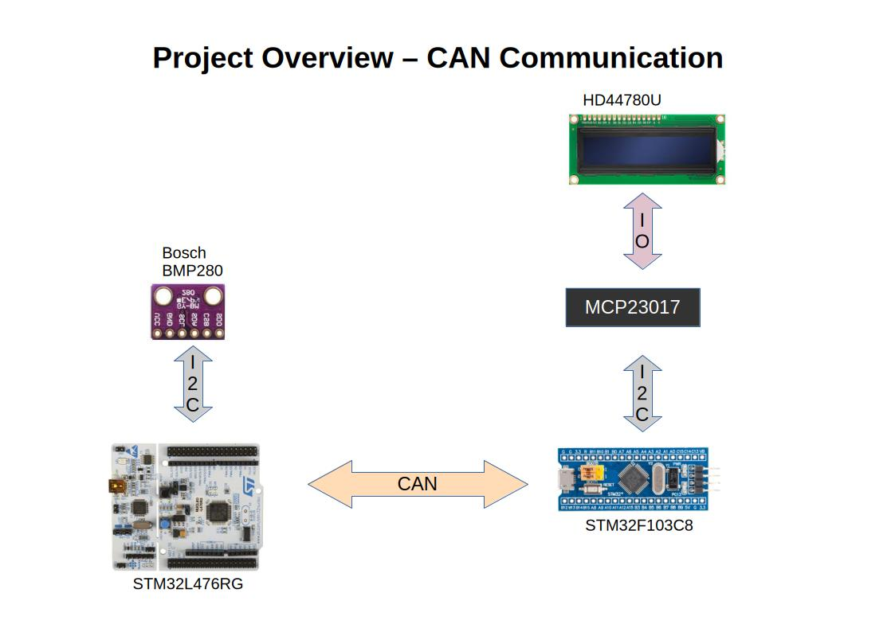
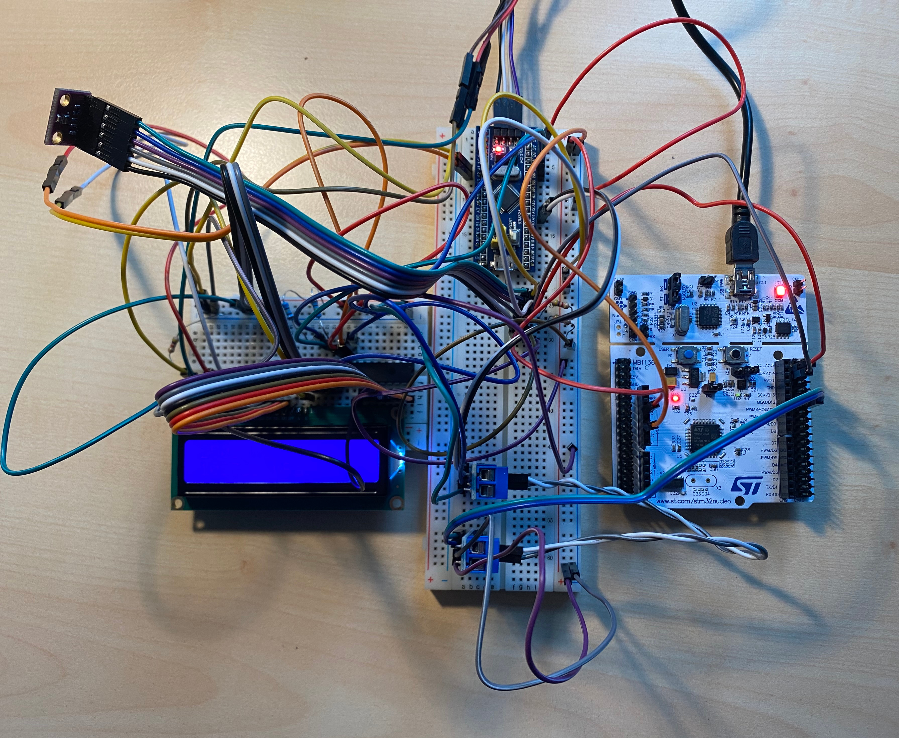

# Dual-Microcontroller CAN Bus Communication System

## Description
The goal of this project is to establish a robust Controller Area Network (CAN) communication link between two distinct microcontroller units (MCUs). The system reads environmental data—specifically ambient temperature and atmospheric pressure—from an external digital sensor and transmits this telemetry data reliably over the CAN bus.

The primary MCU interfaces with the sensor, processes the raw telemetry, and packages it into CAN frames. The secondary MCU receives these data packets via the bus interface and processes them for local visualization.

---

## System Architecture

For a detailed visual overview of the wiring, signal routing, and system architecture, please refer to the diagram below:

### Component Breakdown
* **Microcontrollers:**
    * **STM32L476RG** (ARM Cortex-M4, acting as primary sensor node)
    * **STM32F103C8** (ARM Cortex-M3, acting as secondary display node)
* **Sensors & Peripherals:**
    * **Bosch BMP280** (Digital pressure and temperature sensor via I2C/SPI)
    * **MCP23017** (16-bit I/O expander for peripheral control)
    * **HD44780U** (Dot-matrix LCD driver for local data visualization)
* **Bus Interface:**
    * **SN65HVD230 (VP230)** (3.3V CAN physical layer transceiver)

